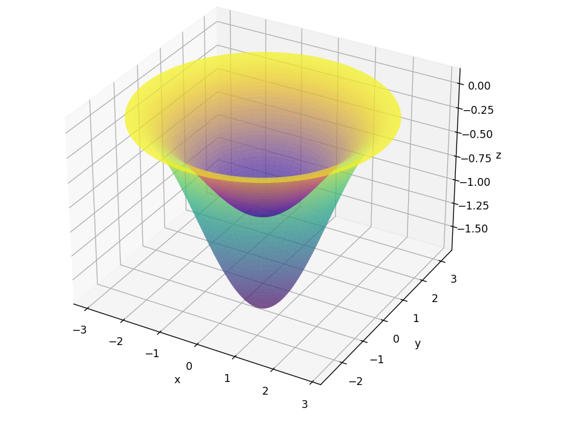

Khối $\Omega_2$ được xác định bởi 2 phương trình:

$$
\begin{cases}
    z_1 &= -1 - \cos(\sqrt{x^2 + y^2}) \\
    z_2 &= -\frac{1}{2} - \frac{1}{2}\cos(\sqrt{x^2 + y^2})
\end{cases}
$$

Đổi sang hệ tọa độ trụ:

$$
\begin{cases}
    x &= r\cos(\theta) \\
    y &= r\sin(\theta) \\
    z &= z
\end{cases}
$$

Thay vào phương trình của $\Omega_2$:

$$
\begin{cases}
    z(r, p)_1 = -1 - \cos(r), 0 \leq r \leq \pi , 0 \leq p \leq 2\pi \\
    z(r, p)_2 = -\frac{1}{2} - \frac{1}{2}\cos(r), 0 \leq r \leq \pi , 0 \leq p \leq 2\pi
\end{cases}
$$

Vậy, $-1 \leq z_1 \leq 0$ và $-2 \leq z_2 \leq 0$

$$
\begin{cases}
    r_1 = \cos(-z-1)^{-1} \\
    r_2 = \cos(-2z - 1)^{-1}
\end{cases}
$$

Gọi n là tổng số mặt cắt của mô hình, giả sử n = 10, ta có $\delta z_1 = \frac{2 - 0}{10} = 0.2$, với mỗi $\delta z$, ta có 1 r tương ứng

Dựa vào hình vẽ:

Ta thấy với $-1 \lt z \leq 0$, mặt cắt là 1 hình vành khăn, nên diện tính được tính bằng công thức: $S = \pi(r_1^2 - r_2^2) (P_1)$

Với $-2 \lt z \leq -1$, mặt cắt là 1 hình tròn, tính bằng công thức: $S = \pi r_1^2 (P_2)$

Vậy, diện tích bề mặt của khối $\Omega_2$ là: $S = P_1 + P_2$
